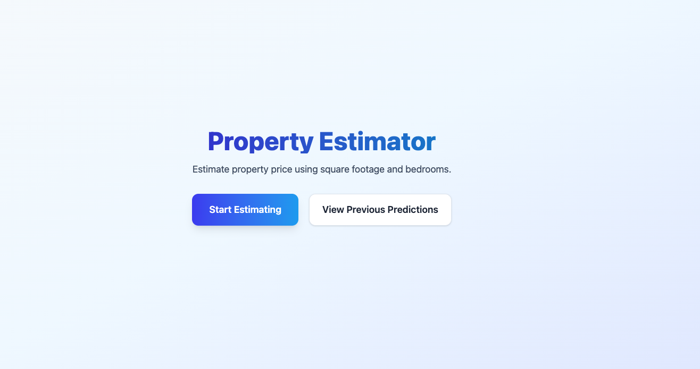
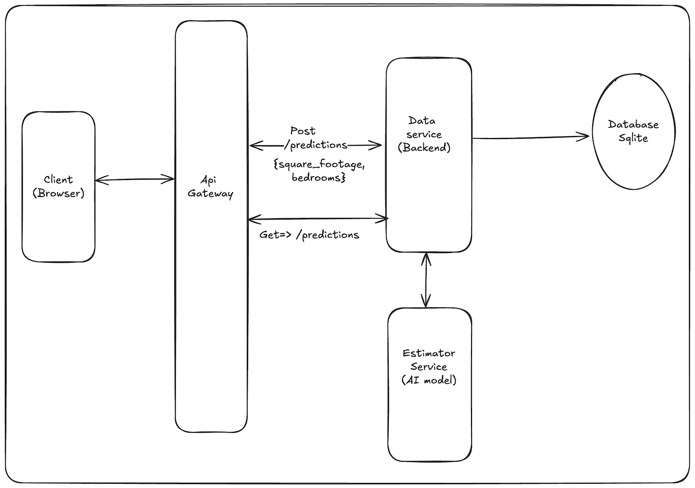

# 🏡 Property Estimator

End-to-end application that estimates property prices via three microservices: a React client, a NestJS API, and a Flask-based ML model.

## 🖥️ Watch the demo

Watch Demo on [Youtube](https://youtu.be/10L8m4ujDA0)
[](https://youtu.be/CQhJX4UkAN0)

---

## Services

-   **client/** – React 19 + Vite UI (port 5173). Core screens live in `src/pages/`, reusable pieces in `src/components/`.
-   **backend/** – NestJS API (port 3001) exposing `POST /predictions` for new estimates, `GET /predictions` for history, storing results in SQLite, and proxying to the ML model when available.
-   **ml-engine/** – Flask app (port 5000) exposing `/predict` and a training script that regenerates the ONNX/Pickle artifacts.

## Quickstart (TL;DR)

```bash
git clone https://github.com/drdesmond/home-price-predictor.git
cd home-price-predictor
npm run start:services
```

Open http://localhost:5173/ and you’re ready to explore. The helper script installs Node and Python dependencies, boots all services, and tears them down when you press `Ctrl+C`.

Prefer a manual setup? Read on.

---

## 1. Prerequisites

| Tool                             | Recommended Version         | Notes                                                                |
| -------------------------------- | --------------------------- | -------------------------------------------------------------------- |
| Node.js                          | 20.x LTS                    | Required for the NestJS backend and React client.                    |
| npm                              | 10.x (bundled with Node 20) | pnpm/yarn work too, but the repo ships with `package-lock.json`.     |
| Python                           | 3.10 – 3.13                 | Used for the ML engine and training script.                          |
| pip                              | Latest                      | Install packages listed in `ml-engine/requirements.txt`.             |
| Git                              | Latest                      | To clone the repository.                                             |
| Xcode Command Line Tools (macOS) | —                           | Needed if you have to rebuild native Node modules such as `sqlite3`. |

> **Tip:** On macOS you can install command line tools with `xcode-select --install`.

---

## 2. Repository Layout

```text
home-price-predictor/
├── backend/      # NestJS API (port 3001)
├── client/       # React UI (port 5173)
└── ml-engine/    # Flask ML service + training utilities (port 5000)
```

Clone the project:

```bash
git clone https://github.com/drdesmond/home-price-predictor.git
cd home-price-predictor
```

---

---

## 3. Running each Service Manually

Start the services in this order:
See specific instruction in section 5 - 8

1. **Flask ML Engine** (`python app.py`) — Required if `MODEL_URL (MODEL_URL=http://127.0.0.1:5000 )` is set; optional when using the bundled ONNX model.
2. **NestJS Backend** (`npm run start:dev`) — Proxies prediction requests, persists results to SQLite, and exposes REST endpoints.
3. **React Client** (`npm run dev`) — Provides the UI at `http://127.0.0.1:5173`.

Visit the client URL, submit a property estimate, then view prediction history. Console logs from each service provide helpful debugging context.

---

## 4. Launch the 3 Services Automatically

To run all three services at once, at the repo root run:

```bash
npm run start:services
```

The script installs missing Node dependencies, bootstraps a Python virtualenv for the ML engine when possible, frees ports (5173, 3001, 5000), and starts Flask, NestJS, and Vite. Press `Ctrl+C` to shut them all down gracefully.
If the script succeeds, the entire stack is live at `http://localhost:5173`, and you can skip the manual steps below.

If the script fails, start each service manually following the order in section 3.

---

## 5. ML Engine (Flask) Setup

> The NestJS backend automatically falls back to the pretrained ONNX model in `backend/src/models` whenever this service is offline. Start Flask server and set `MODEL_URL=http://127.0.0.1:5000` in `.env` in `backend` folder if you want live predictions; otherwise you can continue with just the client and backend with pretrained model.

1.  **Create and activate a virtual environment**

    ```bash
    cd ml-engine
    python3 -m venv .venv
    source .venv/bin/activate        # macOS/Linux
    # .venv\Scripts\activate.ps1     # PowerShell on Windows
    ```

2.  **Install dependencies**

    ```bash
    pip install --upgrade pip
    pip install -r requirements.txt
    ```

3.  **(Optional) Train the model**  
     `bash
python train_model.py
`
    Training exports both `house_price_model.pkl` and `house_price_model.onnx` to: - `ml-engine/models/` - `backend/src/models/`

4.  **Run unit tests**

    ```bash
    pytest
    ```

5.  **Start the Flask API**

    ```bash
    python app.py
    ```

    The service listens on `http://127.0.0.1:5000/predict`.

---

## 6. NestJS Backend Setup

1. **Install dependencies**

    ```bash
    cd backend
    npm install
    ```

    > **macOS/Apple silicon:** if `sqlite3` fails to install, run:
    >
    > ```bash
    > npm rebuild sqlite3 --build-from-source
    > ```

2. **Start the API (watch mode)**

    ```bash
    npm run start:dev
    ```

    The API listens on `http://127.0.0.1:3001`. Key endpoints:

    - `POST /predictions` — proxies to Flask or uses the local ONNX model.
    - `GET /predictions?limit=100` — returns persisted prediction history.

3. **Run backend tests (optional)**

    ```bash
    npm run test
    ```

---

## 7. React Client Setup

1. **Install dependencies**

    ```bash
    cd client
    npm install
    ```

2. **Start the dev server**

    ```bash
    npm run dev
    ```

    Vite serves the UI at `http://127.0.0.1:5173`.

3. **Lint (optional)**

    ```bash
    npm run lint
    ```

4. **Test (optional)**

    ```bash
    npm run test
    ```

The client reads API URLs from `client/src/lib/api.ts`. Update this file if you change the NestJS port.

---

## 8. Configure Environment Variables

Only the NestJS backend needs runtime configuration. Create `backend/.env`:

```bash
# When defined, NestJS forwards prediction requests to the Flask ML service.
# Leave undefined to use the bundled local ONNX model.
MODEL_URL=http://127.0.0.1:5000
```

If `MODEL_URL` is omitted, NestJS falls back to the ONNX file at `backend/src/models/house_price_model.onnx`.

---

## 9. Testing Summary

| Layer     | Command        | Notes                          |
| --------- | -------------- | ------------------------------ |
| ML Engine | `pytest`       | Located in `ml-engine/tests/`. |
| NestJS    | `npm run test` | Runs Jest unit tests.          |
| React     | `npm run test` | Runs Jest unit tests.          |

---

## 10. Troubleshooting

**`sqlite3` build failures**

-   Ensure Xcode Command Line Tools (macOS) or Build Tools for Visual Studio (Windows) are installed.
-   Re-run `npm rebuild sqlite3 --build-from-source`.

**`onnxruntime-node` installation issues**

-   Delete `node_modules` and reinstall with `npm install --build-from-source onnxruntime-node`.
-   Apple silicon users may need Rosetta or to set `npm_config_arch=arm64`.

**Flask cannot find the model file**

-   Run `python train_model.py` to regenerate artifacts.
-   Confirm `ml-engine/models/house_price_model.pkl` exists and restart the Flask app.

**Flask cannot find the model file**

**NestJS falls back to local model unexpectedly**

-   Check that `MODEL_URL` is defined in `backend/.env` and the Flask service is reachable.
-   Set `MODEL_PATH` if you store the ONNX file outside `backend/src/models`.

**React form validation rejects numbers typed slowly**

-   Inputs accept only positive integers; ensure you enter whole numbers for both fields.

---

## 11. Architecture Design

<div align="center">
  
</div>

---

## 12. Useful References

-   `client/README.md` – React/Vite frontend documentation and design notes.
-   `backend/README.md` – NestJS module documentation and design notes.
-   `ml-engine/README.md` – Machine Learning service documentation and design notes.
-   `ml-engine/train_model.py` – Training script with inline comments.
-   `take-home.md` – Original problem statement and sample training data.
